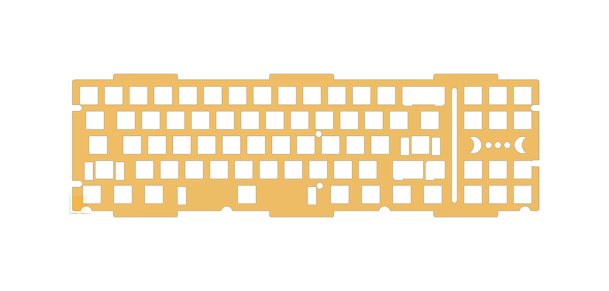
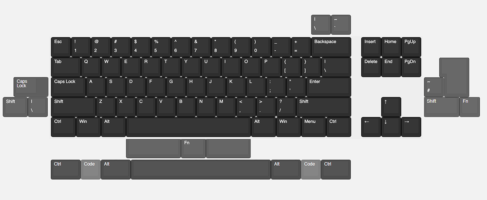

# Eclipse

A 70% gasket-mount custom keyboard designed by [snurrebassen](https://geekhack.org/index.php?topic=113079), featuring a F-row-less TKL layout.



## Specifications

| Spec | Value |
|------|-------|
| Layout | 70% (F-row-less TKL), 71 keys |
| Typing Angle | 7° |
| Front Height | 17.6mm |
| Dimensions | 374mm × 128.62mm |
| Mounting | Gasket mount (12× 50×5mm silicone gaskets) |
| Case Screws | 8× M3×11mm (bottom to top) |
| Daughterboard | 4× M2×4mm |
| Weight Screws | 2× M4×3.5mm (countersunk 90°) |

## Layout Compatibility

The Eclipse supports the following layouts:
- **ANSI**
- **ISO**
- Split-backspace
- Split right-shift
- Tsangan bottom row (WKL/Symmetrical)
- Split spacebar (2.75u / 1.25u / 2.25u)



## What's Included

```
eclipse/
├── pcb/                    # PCB resources
│   ├── eclipsepcb/        # Submodule: PCB design files (KiCad)
│   ├── Mechstudio (MKEU)/ # Pre-flashed VIAL hex
│   └── PCB_Layout-compatibility.jpg
├── plates/                 # Plate files (DXF)
│   ├── Eclipse_ANSI_12-2023.dxf
│   ├── Eclipse_ISO_12-2023.dxf
│   └── Eclipse_SPLIT-SPACE_12-2023.dxf
├── foam/                   # Foam cut files
├── Firmware/               # QMK firmware source
└── specs.md               # Full specifications
```

## PCB

The Eclipse PCB has evolved through several versions:

1. **Original PCB** — Designed by w3bb0, featured per-key RGB (SK6812mini) and underglow
2. **Mechstudio PCB** — Mykeyboard made production changes to fit newer specs, budget and available parts (MCU, SMDs). This is the version included as `pcb/Mechstudio (MKEU)/` with pre-flashed VIAL hex
3. **Martin PCB** — New cleaner PCB by [Martin](https://github.com/arnstadm/eclipsepcb) (not to be confused with w3bb0). Since the Mechstudio source files were no longer available, Martin designed a fresh PCB. **Does not feature underglow or per-key RGB**
4. **Khor PCB** — Hotswap PCB stocked by [Khor](https://khor.store/)

The PCB designs are available in the `pcb/eclipsepcb/` submodule.

### Firmware

Pre-compiled VIAL hex available in `pcb/Mechstudio (MKEU)/mechstudio_eclipse_vial.hex`

For building from source, see the [QMK firmware](https://github.com/snurrebassen/qmk_firmware/tree/master/keyboards/snurrebassen/eclipse) or use the submodule at `pcb/eclipsepcb/qmk files/`.

## Plates

Plates are 1.5mm thick and available in:
- ANSI
- ISO
- Split-space

Plate dimensions: **358.567mm × 110.317mm**

## Build Resources

### Required Parts
| Part | Quantity | Notes |
|------|----------|-------|
| M3×11mm screws | 8 | Socket cap, max Ø5.5mm |
| M2×4mm screws | 4 | Daughterboard |
| M4×3.5mm screws | 2 | Weight, countersunk 90° |
| Bumpons | 4 | 15×8mm, 1.5mm thick, Shore 50A silicone |
| Gaskets | 12 | 50×5mm, 1.5mm thick, Shore 50A silicone |

### Foam
Clearance between bottom case and PCB is 3mm. Foam thickness should not exceed 2mm.
- Foam dimensions: 358.167mm × 100.617mm

## History

- **IC**: February 20, 2020
- **Raffle/GB**: May 31, 2021
- **Production**: November 2021 (CNC milling)
- **Shipping**: July 2022

For the full timeline and discussion, see the [GeekHack thread](https://geekhack.org/index.php?topic=113079).

## Gallery

More renders available in `plates/previews/` and `plates/STEP/STEP previews/`.

## License

See [LICENSE.md](./LICENSE.md) — Eclipse is open source for personal use and modification.

## Acknowledgments

- **Designer**: snurrebassen
- **Original PCB**: w3bb0
- **Mechstudio PCB**: Mykeyboard.eu
- **Martin PCB**: Martin (arnstadm)
- **Khor PCB**: [Khor](https://khor.store/)
- **Community**: GeekHack, r/MechGroupBuys

---

*Eclipse (c) 2022 TypeLab / snurrebassen*
